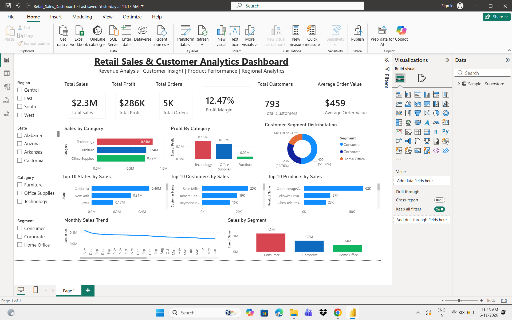

# Retail Sales & Customer Analytics Dashboard

## Project Overview

This project analyzes retail sales performance, customer purchasing behavior, product performance, and regional sales trends using SQL and Power BI.

The dashboard helps businesses identify revenue drivers, customer segments, and top-performing products to support data-driven decision making.

## Tools Used

- SQL
- Power BI
- Microsoft Excel

## Dataset

The dataset contains retail transaction information including:

- Orders
- Customers
- Products
- Categories
- Regions
- Sales
- Profit

## Key Performance Indicators (KPIs)

- Total Sales
- Total Profit
- Total Orders
- Total Customers
- Average Order Value
- Profit Margin

## Dashboard Features

- Sales Analysis
- Customer Insights
- Product Performance Analysis
- Regional Sales Analysis
- Monthly Sales Trend
- Customer Segmentation

## Business Problem

Retail organizations need to understand customer purchasing patterns and product performance to maximize revenue and profitability.

This dashboard provides insights into sales performance and customer behavior across different regions and categories.

## Key Insights

- Technology generates the highest sales revenue.
- Consumer segment contributes the highest sales.
- California is the top-performing state.
- Product performance varies significantly across categories.

## SQL Analysis Included

The project includes SQL scripts for:

- Data Quality Checks
- Sales Performance Analysis
- Customer Behavior Analysis
- Product Performance Analysis
- Customer Segmentation
- Customer Intelligence Reporting
- Regional Performance Analysis
- Time Series Sales Trends

## Skills Demonstrated

- SQL Query Development
- Retail Analytics
- Customer Analytics
- KPI Reporting
- Business Intelligence
- Power BI Dashboard Development
- Data Visualization

## Dashboard Screenshot

